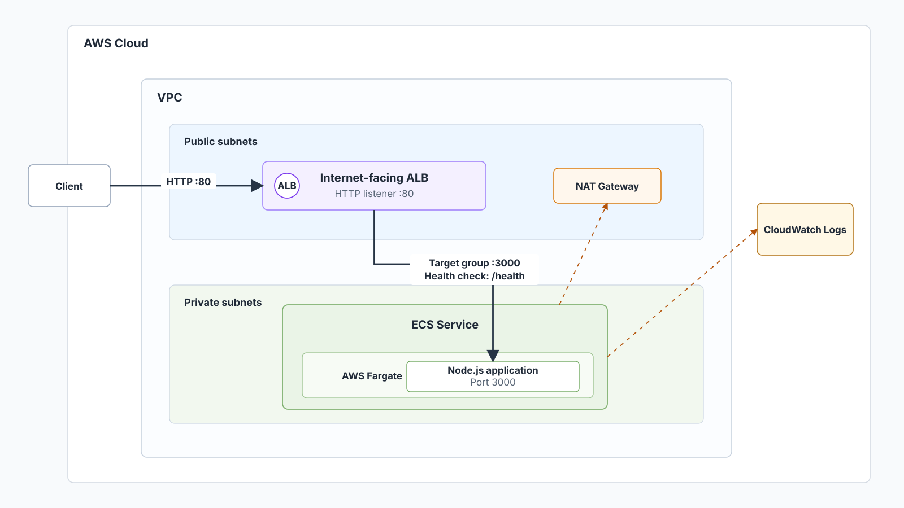

# AWS Containerized Web App

This repository is a compact reference project for running a containerized Node.js web application on AWS using ECS Fargate, an Application Load Balancer, private subnets, and Terraform.

The configuration is intentionally compact so the infrastructure relationships are easy to inspect. It is a focused reference deployment, not a complete container platform.

## Use Case

This project represents a small web application or internal service that runs as a container behind a load balancer while keeping ECS tasks in private subnets.

Realistic examples include a simple backend web service or internal service where the ALB handles public HTTP routing and ECS runs the application container in private subnets.

## What This Lab Demonstrates

- Running a container task on AWS Fargate
- Routing public HTTP traffic through an Application Load Balancer
- Placing ECS tasks in private subnets
- Configuring bounded ECS service autoscaling with CPU and memory target tracking
- Using ECS deployment guardrails for rolling replacement and rollback
- Building a minimal non-root runtime image without compiled test files
- Generating an SBOM and vulnerability report from the validated final image
- Adding a small set of ALB and ECS CloudWatch alarms
- Using native Terraform plan tests for infrastructure contracts
- Using Terraform modules to separate VPC, ALB, ECS, ECR, and observability concerns
- Identifying trade-offs around public access, private task networking, and network cost

## Architecture Overview



The Terraform configuration creates a VPC with public and private subnets, an internet-facing ALB, and an ECS Fargate service. The ALB listens on HTTP port 80 and forwards requests to the Node.js application container on port 3000.

Runtime request flow:

- A user request reaches the public ALB.
- The ALB forwards the request to the ECS target group on port 3000.
- A Fargate task serves the Node.js application from private subnets.
- ALB target health checks call `GET /health`.
- Container logs are sent to CloudWatch Logs for basic runtime inspection.
- Application Auto Scaling adjusts ECS desired count within a small configured range.
- CloudWatch alarms track sustained unhealthy targets, target 5XX responses, and ECS CPU/memory saturation.

The ECS service starts with a low default desired count and can scale within configured min/max capacity. Basic deployment rollback, explicit rolling deployment percentages, and ALB target health behavior are configured.

## AWS Services Used

| Service | Role in this lab |
| --- | --- |
| Amazon VPC | Provides public and private networking |
| Amazon ECS | Runs the container service |
| AWS Fargate | Provides serverless container compute |
| Amazon ECR | Stores the application image in a private immutable-tag repository |
| Elastic Load Balancing | Routes HTTP traffic to ECS tasks |
| Application Auto Scaling | Adjusts ECS service desired count within configured limits |
| AWS IAM | Provides ECS task execution and task roles |
| Amazon CloudWatch | Stores ECS task logs and evaluates runtime alarms |

## What Terraform Creates

The Terraform configuration provisions:

- VPC with public and private subnets
- NAT gateway for private subnet outbound access, which creates standing hourly cost while deployed
- Private ECR repository with immutable tags, scan-on-push, AES256 encryption, and lifecycle retention
- Optional GitHub OIDC IAM role for manually publishing validated images to the ECR repository
- Application Load Balancer and target group
- ECS cluster, task definition, and service
- ECS service Application Auto Scaling target and CPU/memory target tracking policies
- CloudWatch alarms for ALB target health, target 5XX responses, and ECS service saturation
- Security groups for ALB and ECS
- IAM roles for ECS task execution and task permissions
- CloudWatch log group for ECS task logs

## Repository Layout

| Path | Purpose |
| --- | --- |
| `main.tf` | Root Terraform wiring for VPC, ALB, ECR, ECS, and observability modules |
| `variables.tf` | Region, naming, application image, runtime, scaling, and alarm inputs |
| `tests/plan_contracts.tftest.hcl` | Native Terraform plan tests for image, ECR, ECS, ALB, security-group, and autoscaling contracts |
| `app/` | Minimal TypeScript sample app and Dockerfile |
| `.github/workflows/ci.yml` | GitHub Actions workflow for app, container, security-report, and Terraform validation |
| `.github/workflows/release-container-image.yml` | Manual GitHub Actions workflow for approved ECR image publication |
| `docs/deployment-runbook.md` | Manual ECR image publication and digest-pinned deployment workflow |
| `docs/adr/` | Architecture decision records for operational trade-offs |
| `modules/vpc/` | VPC, subnets, and NAT gateway |
| `modules/alb/` | ALB, listener, target group, and ALB security group |
| `modules/ecs-fargate/` | ECS cluster, task definition, service, autoscaling, and IAM roles |
| `modules/ecr/` | Private ECR repository and lifecycle policy |
| `modules/observability/` | Focused CloudWatch runtime alarms |
| `scripts/` | Container scanning and static Terraform, CI, and release regression checks |
| `diagram/` | Architecture diagram |

## How To Deploy

Prerequisites:

- AWS credentials configured locally
- Terraform `>= 1.7.0`
- Docker with an active daemon
- Node.js 24 and npm for local application validation
- A digest-pinned application image reference for `app_image_uri` in the form `<repository-url>@sha256:<64-lowercase-hex-digest>`
- A region where the selected services are available

ECR has a bootstrap dependency: the repository must exist before the first image can be pushed, while the full ECS deployment needs an existing image. Use the deployment runbook for the controlled manual publication flow:

[Container Image Deployment Runbook](docs/deployment-runbook.md)

Initial local infrastructure validation:

```bash
terraform fmt -check -recursive
terraform init -backend=false -input=false
terraform validate -no-color
terraform test -no-color
```

Prepare deployment inputs and review the plan:

```bash
cp terraform.tfvars.example terraform.tfvars
# Edit terraform.tfvars with local values.

terraform init
terraform plan
```

After the ECR repository is bootstrapped, publish an immutable `git-<full-commit-sha>` image tag manually, retrieve its digest, set `app_image_uri` to `<repository-url>@sha256:<64-lowercase-hex-digest>`, and use a normal Terraform plan/apply. Real AWS runtime validation remains pending until that controlled deployment is performed.

Default ECS capacity is intentionally small:

- `service_desired_count = 1`
- `service_min_capacity = 1`
- `service_max_capacity = 3`

Application Auto Scaling can adjust desired count at runtime. Terraform keeps an initial desired count for creation but ignores later `desired_count` drift so it does not fight the autoscaler during normal applies.

## Local Container App

The `app/` directory contains a small Node.js and TypeScript HTTP service with `GET /`, `GET /health`, and 404 responses for unknown routes. The included Dockerfile builds and runs the compiled service on port 3000.

Validate the app locally:

```bash
cd app
npm ci
npm run typecheck
npm test
npm run build
```

Build the container image:

```bash
docker build -t aws-containerized-web-app-local .
```

Run the container smoke test from `app/` when the Docker daemon is active:

```bash
npm run test:container
```

The smoke test builds the image, starts a temporary container on `127.0.0.1`, runs it with a read-only root filesystem, drops Linux capabilities, enables `no-new-privileges`, checks `GET /health` and `GET /`, verifies the runtime UID is not root, stops the container through Docker, checks shutdown logs, and removes the temporary container.

CI uses the same Dockerfile and build context, builds the final image once with a commit-specific local tag, confirms that the runtime image contains `dist/src/server.js` but not compiled tests, and then reuses that same image for the smoke test, SBOM generation, and vulnerability scanning. CI does not tag the image as `latest`, push it to ECR, or deploy it to AWS.

Terraform manages a private ECR repository for the application image. Repository tags are immutable, scan-on-push is enabled, and a lifecycle policy expires untagged images after 7 days while retaining the newest 10 `git-` tagged images.

CI validates the application container but does not publish images. Image publication is handled by a separate manual GitHub Actions workflow that requires the `container-release` GitHub Environment, uses GitHub OIDC for short-lived AWS credentials, publishes an immutable `git-<full-sha>` tag to ECR, and records the remote digest. Publishing an image is not an ECS deployment; ECS receives the full digest-pinned image reference through `app_image_uri` after following the runbook.

## CI Validation

The GitHub Actions workflow:

- Installs the sample app dependencies with `npm ci`
- Typechecks, builds, and tests the TypeScript app
- Builds the final Docker image once
- Confirms the runtime image excludes compiled tests
- Runs the container smoke test against the same image
- Generates a CycloneDX JSON SBOM with Trivy `v0.71.2`
- Generates a Trivy JSON vulnerability report and prints a readable summary
- Fails when Trivy finds fixable CRITICAL vulnerabilities in the final image
- Uploads the SBOM and vulnerability report as 14-day workflow artifacts
- Runs Terraform formatting, backend-disabled initialization, and validation
- Runs native Terraform plan contract tests
- Runs focused static Terraform, CI, and release regression checks

The workflow uses read-only repository permissions. It does not upload SARIF, authenticate to AWS, push to ECR, or deploy resources.

The vulnerability report keeps all reported severities for review. The initial gate is intentionally narrow: HIGH vulnerabilities are visible but do not block CI, unfixed CRITICAL vulnerabilities remain in the report but do not block the current gate, and fixable CRITICAL vulnerabilities fail the workflow. This is a starting policy for a reference project, not a claim that the image is free of risk or that the SBOM is a complete compliance inventory.

## Manual Image Release

The `Release Container Image` workflow is `workflow_dispatch` only. It requires running from `main`, a full 40-character SHA confirmation, and approval through the fixed `container-release` GitHub Environment before it can assume the optional ECR release role.

The workflow builds, smoke-tests, and scans one final local image, then uses GitHub OIDC to push only the immutable `git-<full-sha>` tag to the existing ECR repository. It writes the resolved ECR digest URI to the job summary. It does not update ECS, create a GitHub Release, sign the image, generate provenance, or deploy AWS resources.

## How To Clean Up

```bash
terraform destroy
```

Review the destroy plan before confirming. Load balancers, NAT gateways, Fargate tasks, and CloudWatch resources can continue to create cost if left behind. Autoscaling can increase the service up to `service_max_capacity`, and rolling deployment can temporarily run replacement tasks up to the configured deployment maximum percentage.

The ECR repository uses `force_delete = false`. Terraform cannot destroy a non-empty repository while this setting remains false; remove images intentionally before complete cleanup. This protects stored images from accidental deletion.

## Security Notes

- The ALB listener is public HTTP on port 80 for learning/demo purposes. Real deployments should add HTTPS with ACM, redirect HTTP to HTTPS, and review security controls.
- ECS task ingress is limited to the ALB security group.
- The ECS task definition enables a read-only root filesystem and drops Linux capabilities. ECS task definitions do not expose a direct `no-new-privileges` setting equivalent to the local Docker smoke test.
- The execution role is used for ECS startup operations such as pulling the image and writing logs. The task role has no additional application policies because the app does not call AWS APIs.
- Private ECS tasks continue to use NAT for outbound access, including image pulls and service calls.
- Outbound egress is broad in the demo security groups.
- No authentication or application-layer authorization is implemented.

## Cost Notes

Potential standing cost drivers include:

- NAT gateway hourly charges and data processing
- Application Load Balancer hourly charges
- Fargate task runtime
- CloudWatch Logs storage and ingestion
- CloudWatch alarms

Destroy the stack after testing if you do not need it running.

## Operational Notes

- ECS target tracking uses CPU at 65% and memory at 75%.
- Scale-out cooldown is shorter than scale-in cooldown so capacity can respond faster to pressure and remove capacity more slowly after bursts.
- Either CPU or memory target tracking can request scale-out. Scale-in is conservative and only proceeds when the target tracking policies agree capacity can be reduced.
- During ECS deployments, target tracking scale-in is suspended while scale-out can still occur. `service_max_capacity` remains the hard autoscaling limit.
- Runtime alarms are created even when notification actions are empty.
- To send notifications, pass existing action ARNs through `alarm_action_arns` and `ok_action_arns`.
- Empty action lists mean alarms are visible in CloudWatch but do not send notifications.

## Limitations

- The ALB uses HTTP, not HTTPS.
- No custom domain or certificate is configured.
- The manual ECR release workflow and IAM configuration are statically validated. Live OIDC assumption and ECR publication require Terraform deployment, GitHub Environment setup, and manual workflow execution.
- The ECS task uses `PORT=3000` and `SHUTDOWN_TIMEOUT_MS=10000`. ECS `stopTimeout` is set to 15 seconds, and the ALB target group deregistration delay is set to 30 seconds.
- CI validates the application, final image, security reports, and Terraform contracts but does not publish or deploy.
- Autoscaling activity, alarm data, and rollback behavior still require controlled AWS deployment validation.
- Alarm thresholds are initial reference values and should be reviewed after real traffic observations.
- IAM and security group rules should be reviewed before using this pattern outside a learning or sandbox account.

## Architecture Trade-offs

- ECS Fargate reduces compute management compared with self-managed container hosts, but gives less control over the underlying runtime environment.
- A public ALB with private ECS tasks keeps task networking private while still exposing HTTP entry points.
- A NAT gateway simplifies private subnet outbound access, but it adds standing cost.
- Target tracking keeps capacity bounded and simple, but it still needs real runtime validation before relying on the thresholds.
- CloudWatch alarms improve visibility, but empty action lists do not notify anyone.
- The compact Terraform structure is easier to inspect, but it does not include the controls expected from a complete container platform.

## Next Improvements

- Add HTTPS listener support with ACM.
- Perform a controlled AWS deployment and capture runtime validation evidence.

## Project Maturity

Maturity: Strengthened reference implementation; live AWS runtime validation remains pending.

The repository is useful for discussing Fargate networking, ALB routing, container health checks, bounded service scaling, image integrity, container security checks, and deployment trade-offs. Additional security and operational controls should be selected according to the intended workload before adapting the pattern beyond a learning or sandbox environment.
