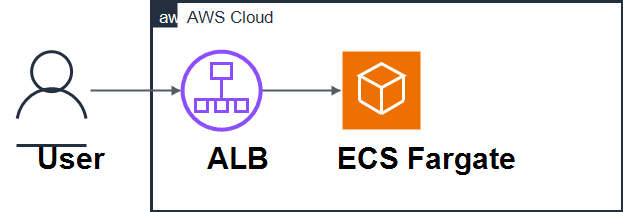

# AWS Containerized Web App

This repository is a compact reference project for running a containerized web application on AWS using ECS Fargate, an Application Load Balancer, private subnets, and EFS shared storage.

The configuration is intentionally compact so the infrastructure relationships are easy to inspect. It is a baseline deployment, not a complete container platform.

## Use Case

This project represents a small web application or internal service that runs as a container behind a load balancer while keeping ECS tasks in private subnets.

Realistic examples include a simple backend web service, admin tool, or content-serving application where the ALB handles public HTTP routing and EFS provides shared file storage across task replacements.

## What This Lab Demonstrates

- Running a container task on AWS Fargate
- Routing public HTTP traffic through an Application Load Balancer
- Placing ECS tasks in private subnets
- Mounting Amazon EFS into containers through an access point
- Using Terraform modules to separate VPC, ALB, EFS, and ECS concerns
- Identifying trade-offs around public access, shared storage, and network cost

## Architecture Overview



The Terraform configuration creates a VPC with public and private subnets, an internet-facing ALB, an ECS Fargate service, and an EFS file system mounted into the task. The ALB listens on HTTP port 80 and forwards requests to the Fargate task.

Runtime request flow:

- A user request reaches the public ALB.
- The ALB forwards the request to the ECS target group.
- A Fargate task serves the application from private subnets.
- The task can mount EFS when shared persistent files are needed.
- Container logs are sent to CloudWatch Logs for basic runtime inspection.

The ECS service uses a fixed desired count. Autoscaling is not currently implemented. Basic deployment rollback and ALB target health behavior are configured.

## AWS Services Used

| Service | Role in this lab |
| --- | --- |
| Amazon VPC | Provides public and private networking |
| Amazon ECS | Runs the container service |
| AWS Fargate | Provides serverless container compute |
| Elastic Load Balancing | Routes HTTP traffic to ECS tasks |
| Amazon EFS | Provides shared persistent file storage |
| AWS IAM | Provides ECS task execution and task roles |
| Amazon CloudWatch Logs | Stores ECS task container logs |

## What Terraform Creates

The Terraform configuration provisions:

- VPC with public and private subnets
- NAT gateway for private subnet outbound access, which creates standing hourly cost while deployed
- Application Load Balancer and target group
- ECS cluster, task definition, and service
- EFS file system, mount targets, and access point
- Security groups for ALB, ECS, and EFS
- IAM roles for ECS task execution and task permissions
- CloudWatch log group for ECS task logs

## Repository Layout

| Path | Purpose |
| --- | --- |
| `main.tf` | Root Terraform wiring for VPC, EFS, ALB, and ECS modules |
| `variables.tf` | Region and container image inputs |
| `modules/vpc/` | VPC, subnets, and NAT gateway |
| `modules/alb/` | ALB, listener, target group, and ALB security group |
| `modules/ecs-fargate/` | ECS cluster, task definition, service, and IAM roles |
| `modules/efs/` | EFS file system, mount targets, access point, and security group |
| `diagram/` | Architecture diagram |
| `images/` | Demo screenshots |

## How To Deploy

Prerequisites:

- AWS credentials configured locally
- Terraform installed
- A region where the selected services are available

Deploy:

```bash
terraform init
terraform plan
terraform apply
terraform output alb_dns_name
```

Open the ALB DNS name in a browser after the service is healthy.

## How To Clean Up

```bash
terraform destroy
```

Review the destroy plan before confirming. EFS, load balancers, NAT gateways, and CloudWatch resources can continue to create cost if left behind.

## Security Notes

- The ALB listener is public HTTP on port 80 for learning/demo purposes. Real deployments should add HTTPS with ACM, redirect HTTP to HTTPS, and review security controls.
- ECS task ingress is limited to the ALB security group.
- EFS NFS ingress is limited to the ECS task security group.
- Outbound egress is broad in the demo security groups.
- No authentication or application-layer authorization is implemented.

## Cost Notes

Potential standing cost drivers include:

- NAT gateway hourly charges and data processing
- Application Load Balancer hourly charges
- Fargate task runtime
- EFS storage and throughput
- CloudWatch Logs storage and ingestion

Destroy the stack after testing if you do not need it running.

## Limitations

- No ECS service autoscaling is configured.
- The ALB uses HTTP, not HTTPS.
- No custom domain or certificate is configured.
- The task definition uses a simple container image input and a bootstrap container to seed basic content.
- No CI/CD workflow is included.
- Observability is limited to ECS task logs and ALB target health checks.
- IAM and security group rules should be reviewed before using this pattern outside a learning or sandbox account.

## Architecture Trade-offs

- ECS Fargate reduces compute management compared with self-managed container hosts, but gives less control over the underlying runtime environment.
- A public ALB with private ECS tasks keeps task networking private while still exposing HTTP entry points.
- EFS supports shared persistent files across task replacements, but stateless containers are simpler to scale and operate.
- A NAT gateway simplifies private subnet outbound access, but it adds standing cost.
- The compact Terraform structure is easier to inspect, but it does not include the controls expected from a complete container platform.

## Next Improvements

- Add HTTPS listener support with ACM.
- Add CloudWatch metrics and alarms for ECS and ALB signals.
- Add ECS service autoscaling policies.
- Add a validation workflow for Terraform formatting and validation.

## Project Maturity

Maturity: Basic / baseline reference project.

This repo is useful for discussing Fargate networking, ALB routing, and EFS trade-offs. It needs additional security, operational, and deployment controls before it should be adapted for real workloads.

## Related Reference Hub

This project is part of my AWS Backend Architecture Reference Hub, which connects backend-focused AWS architecture projects, infrastructure-as-code practice, and engineering trade-offs.

[AWS Architecture Labs](https://github.com/hongzz0618/aws-architecture-labs)
