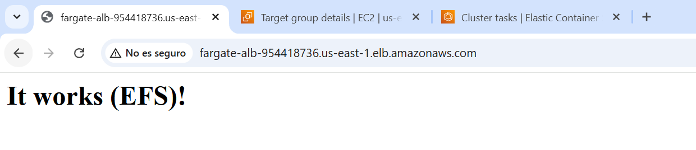
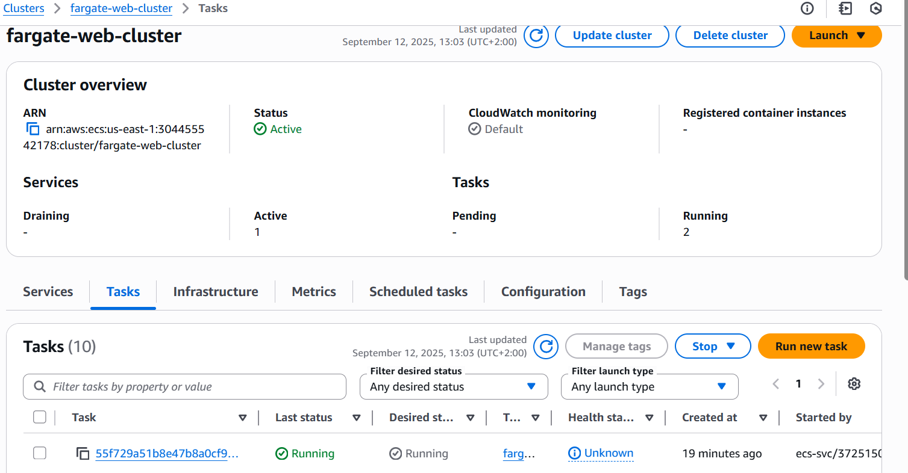
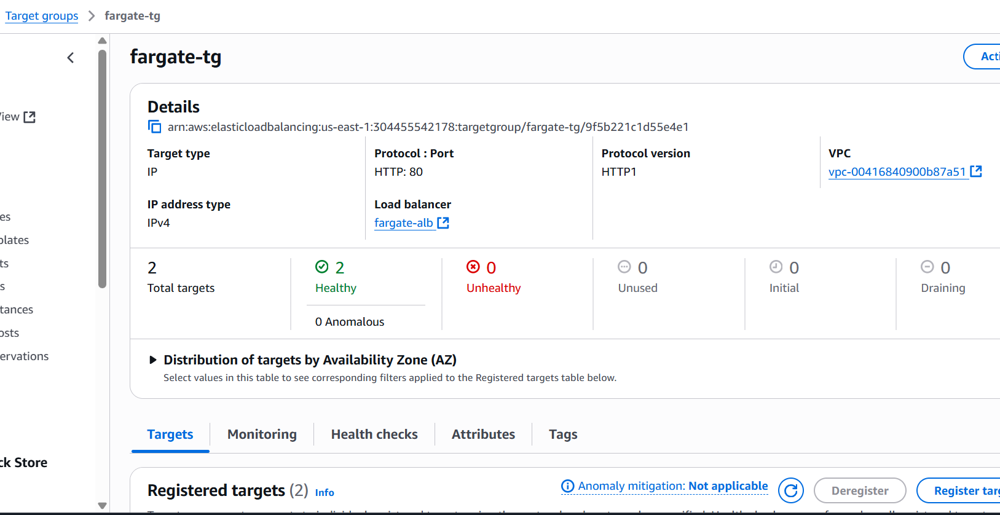
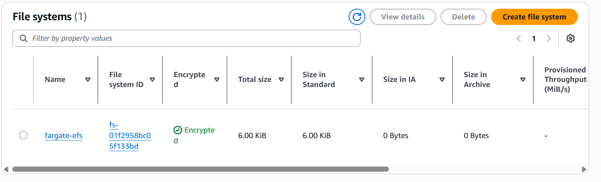

## 🧭 Repository Context

This repository is part of a modularization effort to separate each of the **8 most common AWS architectures** into independent projects.  
The code and resources here were **extracted from a general repository** that originally contained all 8 architectures, to improve clarity, maintainability, and reuse.

🔗 [Original Repository – AWS Architectures Collection](https://github.com/hongzz0618/aws-architecture-collection)

---

## 🐳 Containerized Web App on AWS

This project shows how to run a **containerized web application** using AWS services.  
It uses **ECS Fargate**, **Application Load Balancer (ALB)**, and **Amazon EFS** to deploy a scalable web app with persistent shared storage — all without managing servers.

---

## 📐 Architecture

- **ECS Fargate** → Runs containers without provisioning or managing servers.
- **Application Load Balancer (ALB)** → Routes HTTP traffic to ECS tasks.
- **Elastic File System (EFS)** → Provides shared, persistent storage across tasks.

---

## ✅ Why This Pattern?

| Feature             | Benefit                                      |
|---------------------|----------------------------------------------|
| **Serverless containers** | No EC2 instances to manage or patch     |
| **Scalable**         | Automatically handles traffic with ALB + ECS |
| **Persistent storage** | EFS keeps files even if containers restart |
| **Flexible**         | Great for CMS, web apps, or apps needing shared state |

---

## 🌍 Real-World Use Cases
- Content management systems (CMS)
- Web apps with file uploads or shared assets
- Multi-container apps with persistent state
- Scalable frontend/backend services
---

## 📦 What’s Inside
- Terraform code for:
  - ECS cluster, task definition, and service
  - ALB configuration
  - EFS with access point mounted into containers
- Bootstrap container that seeds a default `index.html` into EFS
- Architecture diagram
- Deployment scripts

---

## 🖼️ Demo Screenshots

Here are a few screenshots of the deployed containerized web app:

  

  
