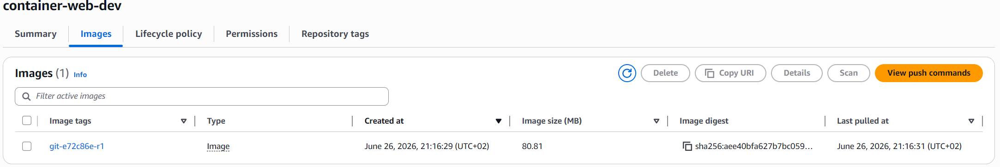
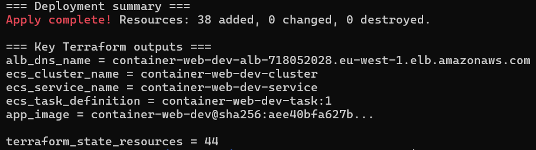
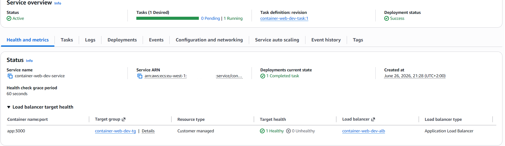
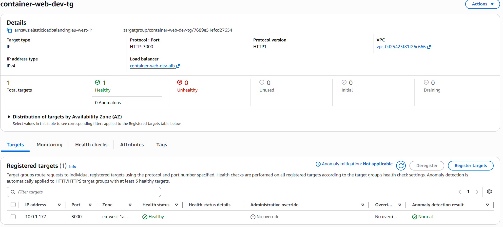
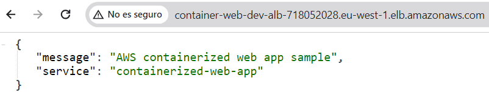
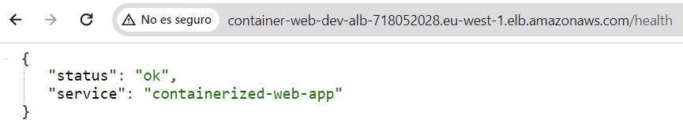
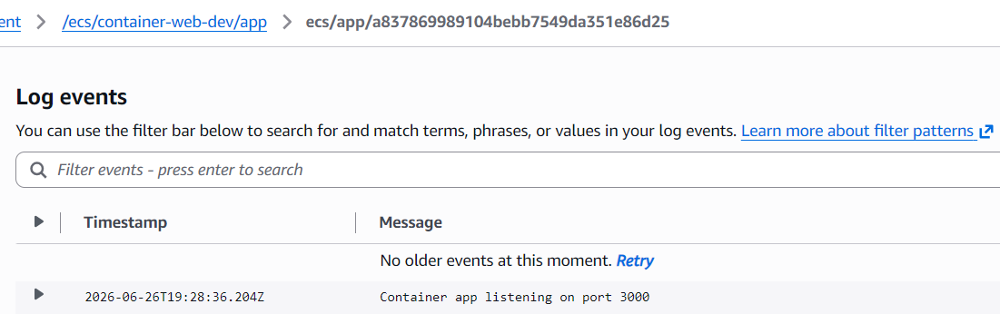
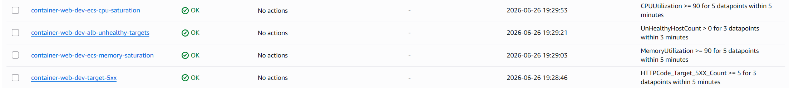
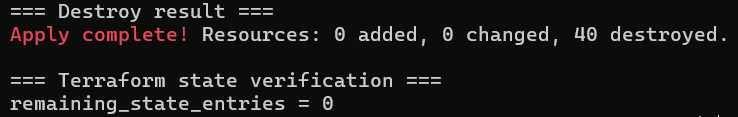

# AWS Deployment Validation

## Validation Summary

The stack was deployed in `eu-west-1` from commit `e72c86e0799df3701f2a81ac69001d166109249c`. Validation covered image publication, infrastructure creation, runtime checks, observability review, teardown, and cleanup.

The work followed this order:

```text
Validate locally -> Bootstrap ECR -> Build and publish image -> Resolve digest -> Deploy infrastructure -> Validate runtime -> Review observability -> Destroy -> Verify cleanup
```

After validation, the environment was destroyed. The application is no longer deployed or publicly available.

## Scope and Environment

The validation covered the Terraform-managed container web stack:

- private ECR repository for the application image
- VPC, public and private subnets, and NAT gateway
- internet-facing Application Load Balancer and target group
- ECS Fargate cluster, task definition, and service
- Application Auto Scaling target and target-tracking policies
- CloudWatch Logs and four runtime CloudWatch alarms
- IAM roles and security groups required by the ECS service

The validation did not include HTTPS, a custom domain, authentication, notification delivery for alarms, forced autoscaling scale-out, or deployment rollback by intentionally triggering a bad deployment.

## Image Publication and Digest Pinning

ECR had to be bootstrapped before the full ECS deployment because the repository must exist before an image can be pushed, while the ECS task definition requires an existing image reference.

The bootstrap created the Terraform-managed ECR repository and lifecycle policy. The application image was then published to repository `container-web-dev` with immutable tag `git-e72c86e-r1`. ECR showed an image size of approximately `80.81 MB`.

The deployed image digest was:

```text
sha256:aee40bfa627b7bc0594414ed37571aacfc2546a0f42bae6860b42841d29f5839
```

ECS was configured with the repository URL and digest rather than a tag such as `latest`. This pinned the task definition to the exact image artifact that was published and reviewed.



## Infrastructure Deployment

After the image digest was available, the full Terraform deployment completed with:

- `38 added`
- `0 changed`
- `0 destroyed`

Terraform outputs included the ECS cluster `container-web-dev-cluster`, ECS service `container-web-dev-service`, task definition `container-web-dev-task:1`, the Application Load Balancer endpoint, and the digest-pinned application image reference.

The Terraform state contained `44` entries after deployment, including managed resources and data sources.



## ECS and Load Balancer Validation

The ECS service was verified in an active steady state:

- service status: `Active`
- desired tasks: `1`
- running tasks: `1`
- pending tasks: `0`
- deployment status: `Success`
- task definition revision: `container-web-dev-task:1`
- health-check grace period: `60 seconds`



The ALB target group was also verified:

- target type: `IP`
- protocol and port: `HTTP:3000`
- total registered targets: `1`
- healthy targets: `1`
- unhealthy targets: `0`



## Runtime Endpoint Validation

The public ALB endpoint returned successful HTTP responses during the validation window.

`GET /` returned:

```json
{
  "message": "AWS containerized web app sample",
  "service": "containerized-web-app"
}
```



`GET /health` returned:

```json
{
  "status": "ok",
  "service": "containerized-web-app"
}
```



## Observability Validation

CloudWatch Logs received the application startup message:

```text
Container app listening on port 3000
```



Four project runtime alarms were reviewed and were in `OK` state:

- `container-web-dev-ecs-cpu-saturation`
- `container-web-dev-ecs-memory-saturation`
- `container-web-dev-alb-unhealthy-targets`
- `container-web-dev-target-5xx`

Alarm notifications were not validated; the Terraform configuration allows empty alarm action lists.



## Cleanup and Residual-Resource Verification

The ECR repository is configured with `force_delete = false`, so the deployed image was intentionally removed before destroying the repository. This allowed cleanup to complete without weakening the repository safeguard against accidental image deletion.

The approved Terraform destroy plan contained:

- `0 to add`
- `0 to change`
- `40 to destroy`

The saved destroy plan was applied successfully with:

- `0 added`
- `0 changed`
- `40 destroyed`

The deployment count and cleanup count are consistent: the initial ECR bootstrap created 2 Terraform-managed resources, and the subsequent full deployment added 38 more resources. Destroying the completed stack removed 40 managed resources.

Terraform state verification then reported:

```text
remaining_state_entries = 0
```

A subsequent account-level AWS cleanup audit found no remaining active resources associated with this Container project across the enabled AWS Regions.



## Evidence

| Evidence | File | Validation point |
| --- | --- | --- |
| ECR image digest | [evidence/01-ecr-image-digest.png](evidence/01-ecr-image-digest.png) | Immutable image tag and deployed digest |
| Terraform apply complete | [evidence/02-terraform-apply-complete.png](evidence/02-terraform-apply-complete.png) | Full infrastructure deployment completed |
| ECS service running | [evidence/03-ecs-service-running.png](evidence/03-ecs-service-running.png) | ECS service active with one running task |
| ALB target healthy | [evidence/04-alb-target-healthy.png](evidence/04-alb-target-healthy.png) | One healthy IP target on `HTTP:3000` |
| ALB application response | [evidence/05-alb-application-response.png](evidence/05-alb-application-response.png) | `GET /` returned the expected JSON |
| ALB health response | [evidence/06-alb-health-response.png](evidence/06-alb-health-response.png) | `GET /health` returned the expected JSON |
| CloudWatch runtime logs | [evidence/07-cloudwatch-runtime-logs.png](evidence/07-cloudwatch-runtime-logs.png) | Container startup log reached CloudWatch Logs |
| CloudWatch runtime alarms | [evidence/08-cloudwatch-runtime-alarms.png](evidence/08-cloudwatch-runtime-alarms.png) | Four runtime alarms reviewed in `OK` state |
| Terraform destroy complete | [evidence/09-terraform-destroy-complete.png](evidence/09-terraform-destroy-complete.png) | Terraform teardown completed |
